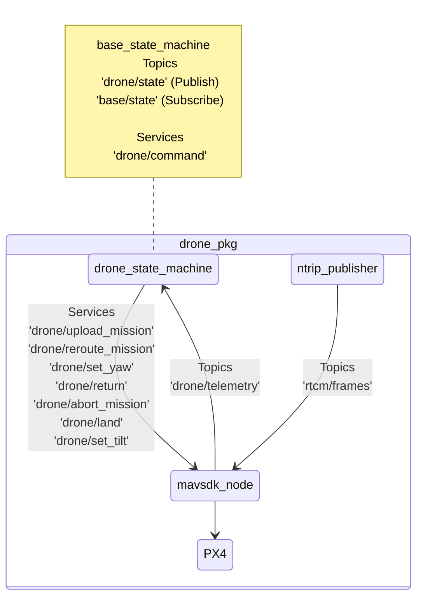
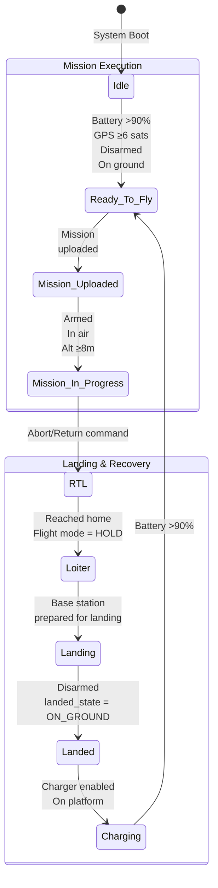

# SWL_Drone_ws

Drone-side ROS2 workspace containing nodes for flight control, mission execution, and telemetry. Runs on the drone's onboard Raspberry Pi and interfaces with the PX4 flight controller via MAVSDK.

---

## Table of Contents
- [File Structure](#file-structure)
- [Packages](#packages)
  - [drone_pkg](#drone_pkg)
    - [drone_state_machine](#drone_state_machine)
    - [mavsdk_node](#mavsdk_node)
    - [ntrip_publisher](#ntrip_publisher)
    - [gimbal_controller](#gimbal_controller)
- [ROS2 Interfaces](#ros2-interfaces)
  - [swl_drone_interfaces](#swl_drone_interfaces)
  - [swl_shared_interfaces](#swl_shared_interfaces)
- [Software Requirements](#software-requirements)
- [Installation](#installation)
- [Configuration](#configuration)
- [Usage](#usage)
- [Development](#development)

---

## File Structure

```
SWL_Drone_ws/
├── src/
│   ├── drone_pkg/
│   │   ├── drone_pkg/
│   │   │   ├── __init__.py
│   │   │   ├── drone_state_machine.py
│   │   │   ├── mavsdk_node.py
│   │   │   ├── ntrip_publisher.py
│   │   │   └── gimbal_controller.py
│   │   ├── launch/
│   │   │   └── drone_system.launch.py
│   │   ├── resource/
│   │   ├── package.xml
│   │   ├── setup.py
│   │   └── setup.cfg
│   │
│   ├── swl_drone_interfaces/
│   │   ├── msg/
│   │   │   └── Telemetry.msg
│   │   ├── srv/
│   │   │   ├── UploadMission.srv
│   │   │   ├── SetYaw.srv
│   │   │   ├── SetPitch.srv
│   │   │   ├── Land.srv
│   │   │   └── Return.srv
│   │   ├── CMakeLists.txt
│   │   └── package.xml
│   │
│   └── swl_shared_interfaces/
│       ├── msg/
│       │   ├── DroneState.msg
│       │   ├── BaseState.msg
│       │   └── Waypoint.msg
│       ├── srv/
│       │   └── DroneCommand.srv
│       ├── CMakeLists.txt
│       └── package.xml
│
├── build/
├── install/
└── log/
```

---

## Packages

### drone_pkg

Core package containing all drone control nodes and utilities.

#### Node Communication



---

### drone_state_machine

Orchestrates drone operations and manages state transitions. Acts as the central coordinator for all drone operations.

**State transitions are mainly handled in `evaluate_state_transitions()`**

#### Available States

- IDLE
- READY_TO_FLY
- MISSION_UPLOADED
- MISSION_IN_PROGRESS
- RTL
- LOITER
- LANDING
- LANDED
- CHARGING

#### State Definitions

| State                   | Description                    | Entry Conditions                         | Exit Conditions                                           | Transition called in         |
| ----------------------- | ------------------------------ | ---------------------------------------- | --------------------------------------------------------- | ---------------------------- |
| **IDLE**                | Drone initialising             | System boot                              | Battery >90%, GPS lock ≥6 satellites, disarmed, on ground | evaluate_state_transitions() |
| **READY_TO_FLY**        | Ready for mission upload       | Good battery, GPS lock, on ground        | Mission successfully uploaded to mavsdk_node              | handle_mission_upload_sync() |
| **MISSION_UPLOADED**    | Mission loaded, ready to start | Mission upload complete                  | Drone is armed                                            | evaluate_state_transitions() |
| **MISSION_IN_PROGRESS** | Actively flying mission        | Airborne                                 | Drone is armed and at an altitude >= 8m                   | handle_return_to_base_sync() |
| **RTL**                 | Returning to launch point      | Return command sent or abort             | Flight mode = "HOLD" (reached home), mission complete     | evaluate_state_transitions() |
| **LOITER**              | Hovering at home position      | RTL complete, at home location           | Landing command from base station                         | handle_landing_sequence()    |
| **LANDING**             | Executing landing sequence     | Base station prepared, landing initiated | Disarmed AND landed_state = "ON_GROUND"                   | evaluate_state_transitions() |
| **LANDED**              | On ground, disarmed            | Touchdown complete                       | Charging initiated                                        | evaluate_state_transitions() |
| **CHARGING**            | Battery charging               | On platform, charger enabled             | Battery >90%                                              | evaluate_state_transitions() |

#### State Flow Diagram



#### ROS2 Interface

**Service Servers:**
- `/drone/command` (DroneCommand) - Receives commands from base station
  - Command types: `upload_mission`, `reroute_mission`, `return_to_base`, `abort_mission`, `pan`, `tilt`

**Service Clients:**
- `/drone/upload_mission` (UploadMission) - Forward mission to MAVSDK
- `/drone/reroute_mission` (UploadMission) - Mid-flight mission modification
- `/drone/set_yaw` (SetYaw) - Control gimbal yaw
- `/drone/set_tilt` (SetPitch) - Control gimbal pitch
- `/drone/return` (Return) - Initiate RTL
- `/drone/abort_mission` (Return) - Emergency abort
- `/drone/land` (Land) - Execute landing

**Published Topics:**
- `/drone/state` (DroneState) - Current drone state to base station

**Subscribed Topics:**
- `/drone/telemetry` (Telemetry) - Raw telemetry from MAVSDK node
- `/base/state` (BaseState) - Base station state for coordination

---

### mavsdk_node

Interfaces directly with PX4 flight controller using MAVSDK Python library to execute flight commands. Translates ROS2 service calls into MAVLink commands and streams telemetry data from PX4 to ROS2 network.

#### ROS2 Interface

**Service Servers:**
- `/drone/upload_mission` (UploadMission) - Upload waypoint mission to PX4
- `/drone/reroute_mission` (UploadMission) - Replace current mission mid-flight
- `/drone/set_yaw` (SetYaw) - Command gimbal yaw change
- `/drone/set_tilt` (SetPitch) - Command gimbal pitch change
- `/drone/land` (Land) - Execute landing via RTL action
- `/drone/return` (Return) - Return to launch with waypoints
- `/drone/abort_mission` (Return) - Abort and return to base

**Published Topics:**
- `/drone/telemetry` (Telemetry) - Consolidated flight data

**Subscribed Topics:**
- `/rtcm/frames` (UInt8MultiArray) - RTK correction data from NTRIP

#### Connection Configuration

Handled by `connect_to_drone()`:
- **SITL (simulation):** `udp://:14550`
- **Flight Controller:** `serial:///dev/drone:115200`

> **Note:** To switch between SITL and hardware modes, see the [main repository Usage section](../README.md#usage)

---

### ntrip_publisher

Connects to NTRIP server and streams RTK correction data (RTCM format) for centimeter-level GPS accuracy.

#### Key Features

- Uses `pygnssutils` library for NTRIP client implementation
- Establishes connection to NTRIP caster (e.g., RTK2go)
- Receives RTCM 3.x correction messages from base station
- Publishes corrections to ROS2 for injection into PX4

#### ROS2 Interface

**Published Topics:**
- `/rtcm/frames` (UInt8MultiArray) - RTCM correction data

#### Configuration Parameters

- `server` - NTRIP server address (default: rtk2go.com)
- `port` - Server port (default: 2101)
- `mountpoint` - NTRIP mountpoint name
- `user` - NTRIP username
- `password` - NTRIP password
- `ggainterval` - GGA message interval (-1=none, 0=once, >0=seconds)
- `ggamode` - GGA mode (1=fixed reference coordinates)
- `reflat`, `reflon`, `refalt`, `refsep` - Reference position parameters

#### Threading Architecture

- NTRIP client thread - Connects to server and receives corrections
- Data publishing thread - Publishes RTCM frames to ROS2
- Queue-based communication between threads for thread safety

---

### gimbal_controller

A utility class (not a ROS2 node) providing gimbal control functionality for camera positioning during flight.

#### Key Features

- **Position Tracking:** Maintains internal state of current gimbal angles to prevent position drift
- **Absolute Positioning:** Set specific pitch/yaw angles
- **Relative Movement:** Pan/tilt by delta amounts from current position
- **Limit Enforcement:** Automatically clamps angles to hardware limits and reports when limits are reached

#### Gimbal Specifications

- **Yaw Range:** -60° (left) to +65° (right)
- **Pitch Range:** -30° (down) to +30° (up)
- **Control Method:** PWM commands via PX4 AUX outputs
  - AUX 2: Yaw control
  - AUX 3: Pitch control

#### Core Methods

- `set_yaw(angle_deg)` - Absolute yaw positioning
- `set_pitch(angle_deg)` - Absolute pitch positioning
- `pan_relative(delta_yaw_deg)` - Relative yaw movement
- `tilt_relative(delta_pitch_deg)` - Relative pitch movement
- `center()` - Return to (0°, 0°) position
- `get_position()` - Query current angles
- `get_remaining_range()` - Check available movement range

#### PWM Mapping

- Linear mapping from angle range to PWM (-1 to +1)
- Prevents wrapping issues during continuous panning
- Returns clamp status when movement hits limits

**Usage:** Imported by other drone_pkg nodes that require camera control functionality.

---

## ROS2 Interfaces

### swl_drone_interfaces

Drone-specific message and service definitions.

#### Messages

**Telemetry.msg** - Raw telemetry from PX4 via MAVSDK

```
std_msgs/Header header
float64 latitude
float64 longitude
float32 altitude
bool armed
string flight_mode
bool is_in_air
float64 battery_percentage
int32 num_satellites
string landed_state
float64 velocity_x
float64 velocity_y
float64 velocity_z
string drone_id
float64 current_yaw
bool mission_complete
```

#### Services

**UploadMission.srv** - Upload waypoint mission to drone (used for mission reroute and upload mission)

```
# Request
swl_shared_interfaces/Waypoint[] waypoints
---
# Response
bool success
string message
```

**SetYaw.srv** - Set gimbal yaw

```
# Request
bool yaw_cw
float64 yaw_degrees
---
# Response
bool success
string message
```

**SetPitch.srv** - Set gimbal pitch

```
# Request
bool tilt_cw
float64 pitch_degrees
---
# Response
bool success
string message
```

**Land.srv** - Execute landing sequence

```
# Request
bool land_trigger
---
# Response
bool success
string message
```

**Return.srv** - Return to launch with optional waypoints

```
# Request
swl_shared_interfaces/Waypoint[] waypoints
---
# Response
bool success
string message
```

---

### swl_shared_interfaces

Shared message and service definitions used by both drone and base station for coordination.

#### Messages

**DroneState.msg** - High-level drone state published to base station and API

```
std_msgs/Header header
float64 latitude
float64 longitude
float32 altitude
bool armed
string flight_mode
bool is_in_air
float64 battery_percentage
int32 num_satellites
string landed_state
float64 velocity_x
float64 velocity_y
float64 velocity_z
string drone_id
float64 current_yaw
bool mission_complete
string current_state
```

**BaseState.msg** - Base station state published to drone and API

```
std_msgs/Header header
string current_state
```

**Waypoint.msg** - GPS waypoint definition

```
float64 latitude
float64 longitude
float32 altitude
float32 speed
```

#### Services

**DroneCommand.srv** - Commands from base station to drone

```
# Request
string command_type
Waypoint[] waypoints
string drone_id
string base_state
float64 yaw_cw
float64 pitch_degrees
---
# Response
bool success
```

---

## Software Requirements

| Software                 | Version | Purpose                                 | Install                                                              |
| ------------------------ | ------- | --------------------------------------- | -------------------------------------------------------------------- |
| Ubuntu Server            | 22.04.5 | Operating system                        | Use Raspberry Pi Imager to flash                                     |
| Python                   | 3.10.12 | Programming language                    | `sudo apt install python3`                                           |
| ROS2                     | Humble  | Robot Operating System framework        | https://docs.ros.org/en/humble/Installation/Ubuntu-Install-Debs.html |
| mavsdk                   | 3.0.1   | Flight controller communication library | `pip install mavsdk==3.0.1`                                          |
| pygnssutils              | 1.1.16  | NTRIP client for RTK GPS corrections    | `pip install pygnssutils==1.1.16`                                    |
| colcon-common-extensions | 0.3.0   | ROS2 workspace build tool               | `sudo apt install python3-colcon-common-extensions`                  |
| DDS-Router               | 3.3.0   | Distributed ROS2 communication          | https://github.com/eProsima/DDS-Router                               |
| Tailscale                | 1.90.8  | VPN for secure device networking        | `curl -fsSL https://tailscale.com/install.sh \| sh`                  |
| ModemManager             | 1.20.0  | Cellular modem management (SIM7600G-H)  | `sudo apt install modemmanager`                                      |
| libqmi                   | 1.32.0  | QMI protocol for Qualcomm modems        | `sudo apt install libqmi-utils -y`                                   |

---

## Installation

### 1. Clone the Parent Repository

```bash
# Clone with all submodules
git clone --recursive https://github.com/your-org/Spiderweb_Labs_Genesis.git
cd Spiderweb_Labs_Genesis/SWL_Drone_ws
```

### 2. Install ROS2 Dependencies

```bash
# Update package list
sudo apt update

# Install required ROS2 packages
sudo apt install python3-colcon-common-extensions

# Install Python dependencies
pip install mavsdk==3.0.1
pip install pygnssutils==1.1.16
```

### 3. Build the Workspace

```bash
cd ~/SWL_Drone_ws
colcon build
source install/setup.bash

# Add to bashrc for automatic sourcing
echo "source ~/SWL_Drone_ws/install/setup.bash" >> ~/.bashrc
```

---

## Configuration

### DDS-Router Configuration

Create DDS-Router configuration file for drone:

```bash
mkdir -p ~/dds_router_config
nano ~/dds_router_config/drone_router.yaml
```

Add the following content:

```yaml
version: v5.0

participants:
  - name: local
    kind: local
    domain: 42

  - name: wan
    kind: wan
    connection-addresses:
      - ip: 100.104.63.87  # Base station Pi Tailscale IP
        port: 11666
        transport: tcp
```

### Create DDS-Router Service

```bash
sudo nano /etc/systemd/system/dds-router-drone.service
```

Add the following content:

```ini
[Unit]
Description=DDS Router - Drone Client
After=network-online.target tailscaled.service
Wants=network-online.target tailscaled.service

[Service]
Type=simple
User=spiderweb
WorkingDirectory=/home/spiderweb/dds_router_config
Environment="HOME=/home/spiderweb"

ExecStart=/bin/bash -c 'source /home/spiderweb/DDS-Router/install/setup.bash && ddsrouter -c /home/spiderweb/dds_router_config/drone_router.yaml'

Restart=always
RestartSec=5

[Install]
WantedBy=multi-user.target
```

Enable and start the service:

```bash
sudo systemctl daemon-reload
sudo systemctl enable dds-router-drone.service
sudo systemctl start dds-router-drone.service
```

### GSM Modem Configuration

Create modem connection service:

```bash
sudo nano /etc/systemd/system/modem-connect.service
```

Add the following content:

```ini
[Unit]
Description=Connect SIM7600 4G Modem
After=network.target ModemManager.service
Requires=ModemManager.service

[Service]
Type=oneshot
ExecStart=/usr/bin/mmcli -m 0 --simple-connect="apn=myMTN"
RemainAfterExit=yes

[Install]
WantedBy=multi-user.target
```

Enable and start:

```bash
sudo systemctl enable modem-connect.service
sudo systemctl start modem-connect.service
```

### udev Rules for Flight Controller

Create udev rule for PX4:

```bash
sudo nano /etc/udev/rules.d/99-px4.rules
```

Add:

```
SUBSYSTEM=="tty", ATTRS{idVendor}=="26ac", ATTRS{idProduct}=="0032", SYMLINK+="drone", MODE="0666"
```

Reload udev rules:

```bash
sudo udevadm control --reload-rules
sudo udevadm trigger
```

### NTRIP Configuration

Edit NTRIP credentials in `ntrip_publisher.py`:

```python
self.declare_parameter('server', 'rtk2go.com')
self.declare_parameter('port', 2101)
self.declare_parameter('mountpoint', 'SpiderwebUniversity')
self.declare_parameter('user', 'matt.vanwyk2-at-gmail.com')
self.declare_parameter('password', 'SWL1210!')
```

---

## Usage

### Quick Start

```bash
cd ~/SWL_Drone_ws
ros2 launch drone_pkg drone_system.launch.py
```

### Verify System Running

```bash
# Check nodes
ros2 node list
# Expected: /drone_state_machine, /mavsdk_node, /ntrip_publisher

# Monitor drone state
ros2 topic echo /drone/state

# Monitor telemetry
ros2 topic echo /drone/telemetry
```

> **For complete SITL and hardware usage instructions, see the [main repository Usage section](../README.md#usage)**

---

## Development

### Adding New Nodes

1. Create new Python file in `src/drone_pkg/drone_pkg/`
2. Add entry point in `setup.py`:

```python
entry_points={
    'console_scripts': [
        'your_new_node = drone_pkg.your_new_node:main',
    ],
}
```

3. Rebuild workspace:

```bash
colcon build --packages-select drone_pkg
```

### Testing Individual Nodes

Run nodes individually for testing:

```bash
# Drone state machine
ros2 run drone_pkg drone_state_machine

# MAVSDK node
ros2 run drone_pkg mavsdk_node

# NTRIP publisher
ros2 run drone_pkg ntrip_publisher
```

### Common Issues

**PX4 not connecting:**
- Check `/dev/drone` exists: `ls -l /dev/drone`
- Verify udev rules: `cat /etc/udev/rules.d/99-px4.rules`
- Check PX4 is powered and connected via USB

**NTRIP not working:**
- Check credentials in `ntrip_publisher.py`
- Monitor NTRIP logs in terminal output

**DDS-Router not connecting:**
- Check Tailscale: `sudo tailscale status`
- Verify base station IP in `drone_router.yaml`
- Check service status: `systemctl status dds-router-drone.service`
- **Important:** Start drone nodes BEFORE starting dds-router service:
  ```bash
  # Kill drone nodes if running
  # Stop DDS router
  sudo systemctl stop dds-router-drone.service
  # Start drone nodes
  ros2 launch drone_pkg drone_system.launch.py
  # In separate terminal, start DDS router
  sudo systemctl start dds-router-drone.service
  ```

**GSM Modem not connecting:**
- Check modem detected: `mmcli -L`
- Check signal strength: `mmcli -m 0`
- Verify SIM has data and APN is correct
- Check service: `systemctl status modem-connect.service`

**State machine stuck:**
- Check telemetry: `ros2 topic echo /drone/telemetry`
- Verify GPS satellites: Should have ≥6 satellites
- Check battery: Should be >90% for Ready_To_Fly
- Verify base station connection: `ros2 topic echo /base/state`

---

## Related Documentation

- [Main Repository README](../README.md) - System overview, hardware requirements, SITL/hardware usage, troubleshooting
- [SWL_base_ws README](../SWL_base_ws/README.md) - Base station documentation
- [Arduino README](../Arduino/README.md) - Hardware controller firmware documentation